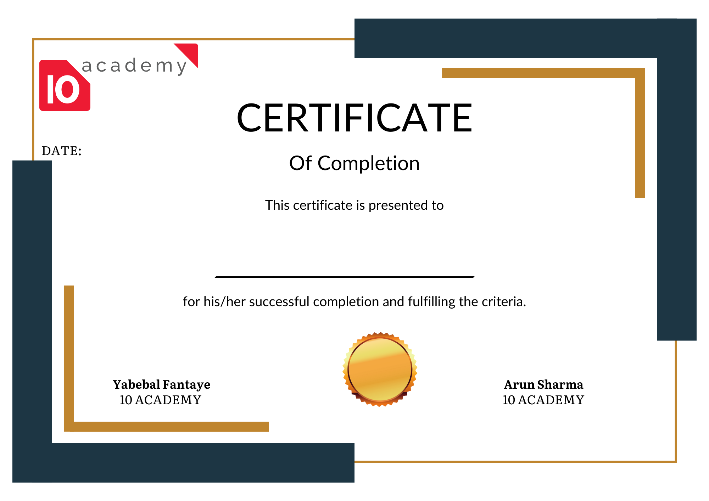
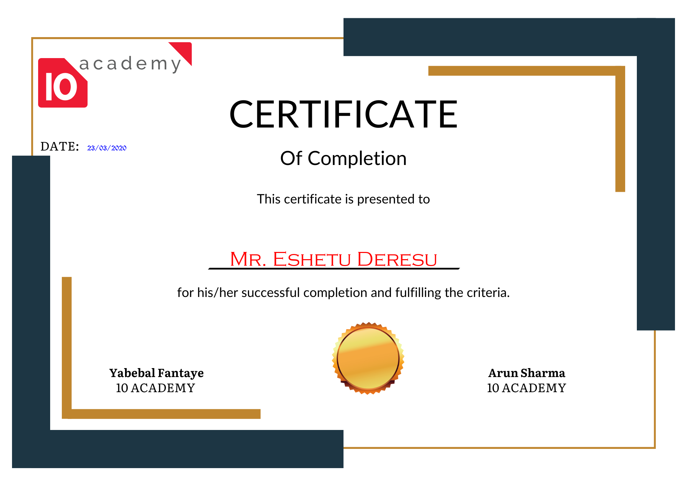

# Algorand project
Under this project we have implemented Image generation Using OpenAI and OpenCV. and Also we have set up the environment for Algorand back end and front end in Beaker and React using AlgoKit

## Image Creating Using OpenAi
I am able to generate image using openai after several prompt modification. 

is the image I have generated with openai. Eventhough the image created by open ai is not satisfying but it is promising. So I have decided to create my own template for certificate to be generated for 10 Academy graduate. The one I made with Cancas is:

With the help of OpenCv library I managed to gemerate Dynamic Certificate for every graduate and the final version will look like.

 

This starter full stack project has been generated using AlgoKit. See below for default getting started instructions.

## Setup

### Initial setup

1. Clone this repository locally.
2. Install pre-requisites:
   - Make sure to have [Docker](https://www.docker.com/) installed and running on your machine.
   - Install `AlgoKit` - [Link](https://github.com/algorandfoundation/algokit-cli#install): The minimum required version is `1.3.0`. Ensure you can execute `algokit --version` and get `1.3.0` or later.
   - Bootstrap your local environment; run `algokit bootstrap all` within this folder, which will install Poetry, run `npm install` and `poetry install` in the root directory to install NPM and Python packages respectively, set up a `.venv` folder with a Python virtual environment and also install all Python dependencies.
     - For TypeScript projects, it will also run `npm install` to install NPM packages.
     - For all projects, it will copy `.env.template` to `.env`.
   - Run `algokit localnet start` to start a local Algorand network in Docker. If you are using VS Code launch configurations provided by the template, this will be done automatically for you.
3. Open the project and start debugging / developing on:
   - [Backend](backend/README.md) - Refer to the README for more information on how to work with smart contracts.
   - [Frontend](frontend/README.md) - Refer to the README for more information on how to work with the frontend application.

### Subsequently

1. If you update to the latest source code and there are new dependencies, you will need to run `algokit bootstrap all` again.
2. Follow step 3 above.

### Continuous Integration / Continuous Deployment (CI/CD)

This project uses [GitHub Actions](https://docs.github.com/en/actions/learn-github-actions/understanding-github-actions) to define CI/CD workflows, which are located in the [`.github/workflows`](./.github/workflows) folder. You can configure these actions to suit your project's needs, including CI checks, audits, linting, type checking, testing, and deployments to TestNet.

For pushes to `main` branch, after the above checks pass, the following deployment actions are performed:
  - The smart contract(s) are deployed to TestNet using [AlgoNode](https://algonode.io).
  - The frontend application is deployed to a provider of your choice (Netlify, Vercel, etc.). See [frontend README](frontend/README.md) for more information.

> Please note deployment of smart contracts is done via `algokit deploy` command which can be invoked both via CI as seen on this project, or locally. For more information on how to use `algokit deploy` please see [AlgoKit documentation](https://github.com/algorandfoundation/algokit-cli/blob/main/docs/features/deploy.md).

## Tools

This project makes use of Python and React to build Algorand smart contracts and to provide a base project configuration to develop frontends for your Algorand dApps and interactions with smart contracts. The following tools are in use:

- Algorand, AlgoKit, and AlgoKit Utils
- Python dependencies including Poetry, Black, Ruff or Flake8, mypy, pytest, and pip-audit
- React and related dependencies including AlgoKit Utils, Tailwind CSS, daisyUI, use-wallet, npm, jest, playwright, Prettier, ESLint, and Github Actions workflows for build validation

### VS Code

It has also been configured to have a productive dev experience out of the box in [VS Code](https://code.visualstudio.com/), see the [backend .vscode](./backend/.vscode) and [frontend .vscode](./frontend/.vscode) folders for more details.

## Integrating with smart contracts and application clients

Refer to the [backend](backend/README.md) folder for overview of working with smart contracts, [frontend](frontend/README.md) for overview of the React project and the [frontend/contracts](frontend/src/contracts/README.md) folder for README on adding new smart contracts from backend as application clients on your frontend. The templates provided in these folders will help you get started.
When you compile and generate smart contract artifacts, your frontend component will automatically generate typescript application clients from smart contract artifacts and move them to `frontend/src/contracts` folder, see [`generate:app-clients` in package.json](frontend/package.json). Afterwards, you are free to import and use them in your frontend application.

The frontend starter also provides an example of interactions with your HelloWorldClient in [`AppCalls.tsx`](frontend/src/components/AppCalls.tsx) component by default.

## Next Steps

You can take this project and customize it to build your own decentralized applications on Algorand. Make sure to understand how to use AlgoKit and how to write smart contracts for Algorand before you start.
